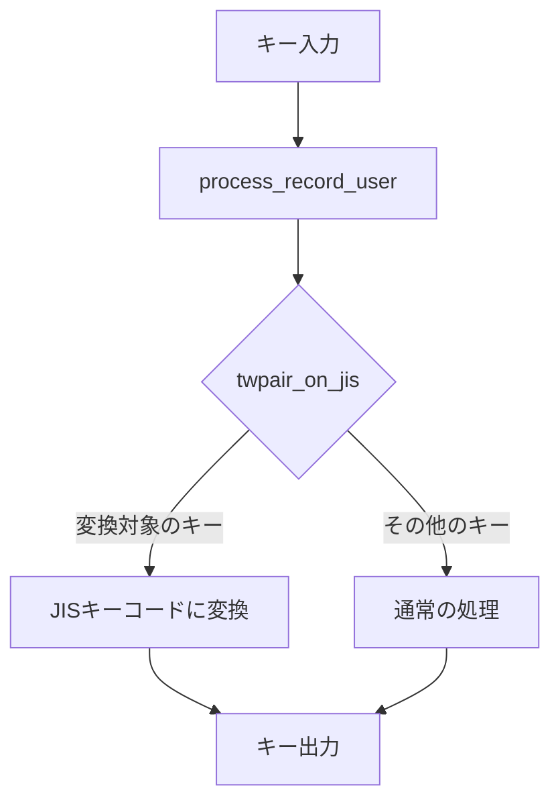

# US 配列から JIS 配列への変換実装プラン

## 現状の理解

-   keymap.c は US 配列のキーマップが定義されています
-   twpair_on_jis.c は US 配列のキーコードを JIS 配列のキーコードに変換する機能を提供しています
-   変換テーブル`us2jis`とそれを使用する`twpair_on_jis`関数が実装されています

## 必要な変更

1. keymap.c に`twpair_on_jis.c`をインクルードする
2. process_record_user 関数を修正して、キー入力時に twpair_on_jis 関数を呼び出すようにする

## 期待される結果

-   OS で日本語キーボードとして認識されている状態で、US キーキャップの記号が正しく入力できるようになる
-   例：Shift + 2 で@が入力できる

## 実装フロー

